### Register endpoint

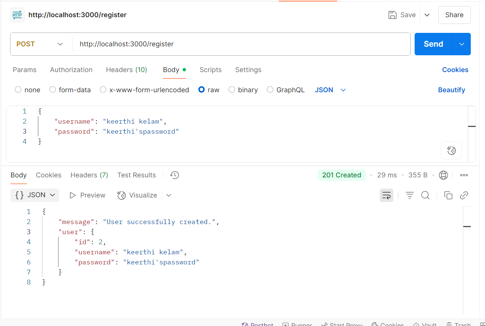

### Login endpoint

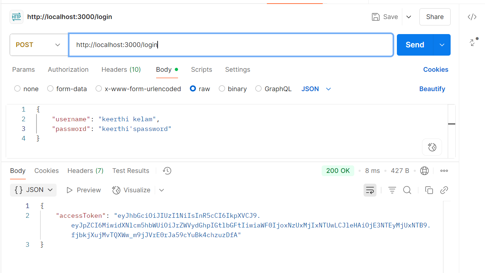

### secret-quote end point

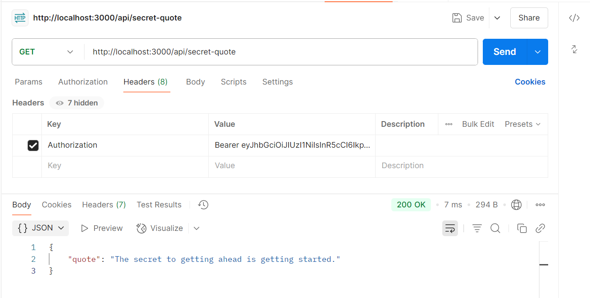

### forbidden

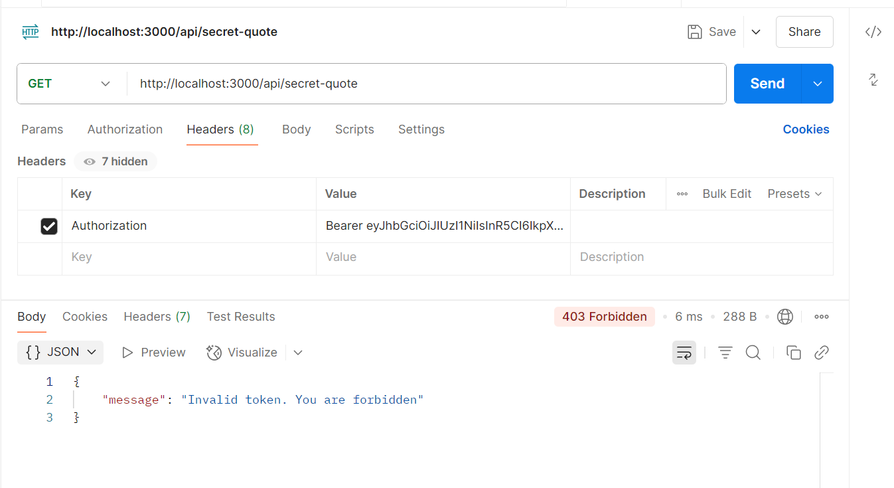

### missing token

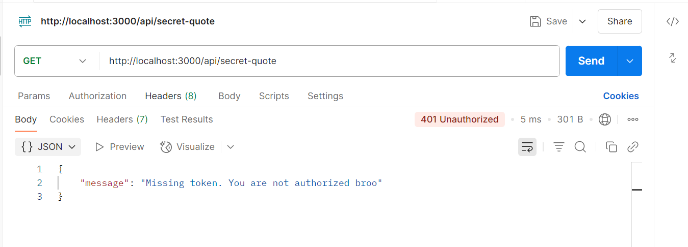

### enhancing security using bcrypt
### register
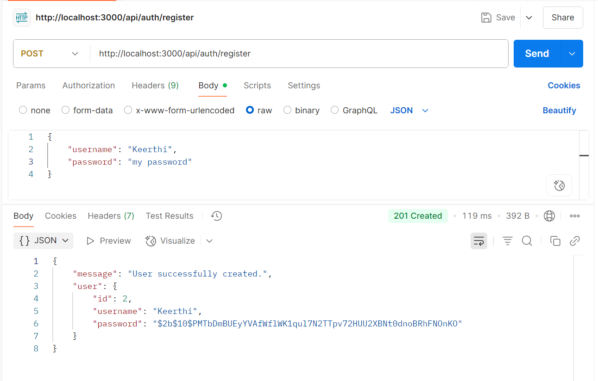

### login after bcypt
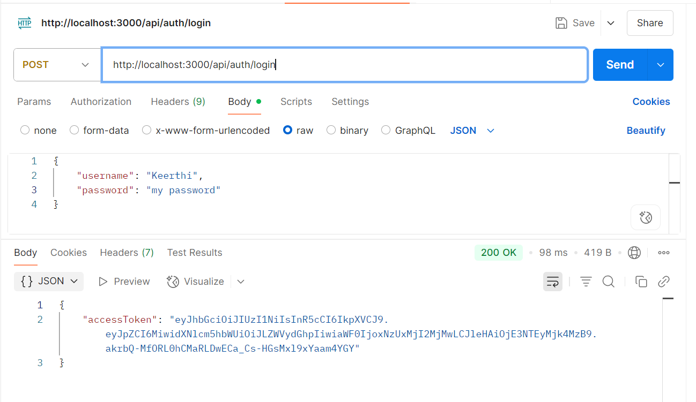

### CRUD for todos

### post a todo
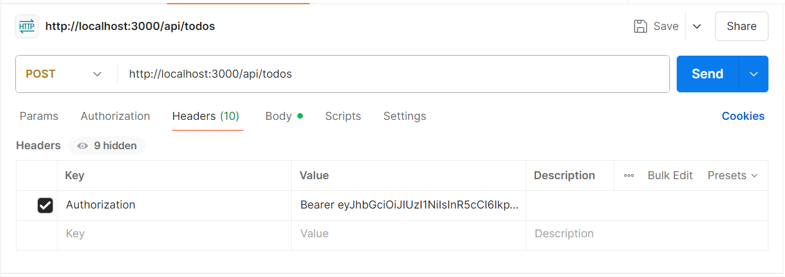
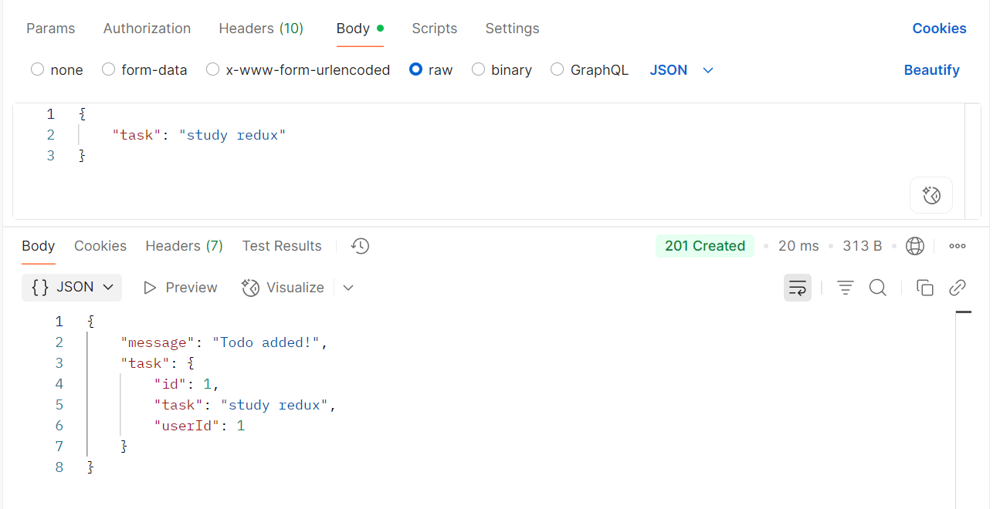

### get todos of that user
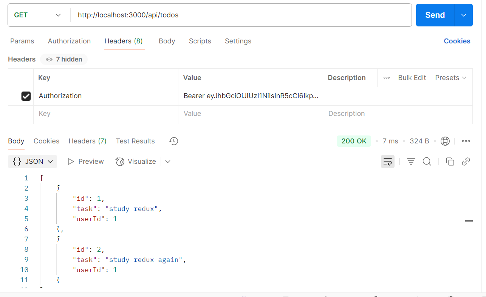

### delete a todo

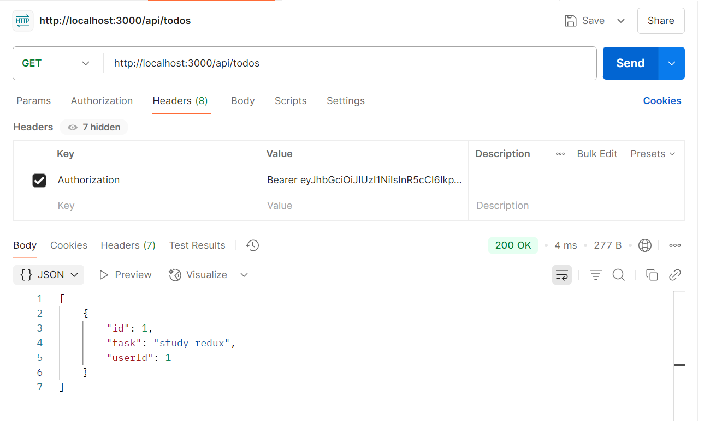
  
